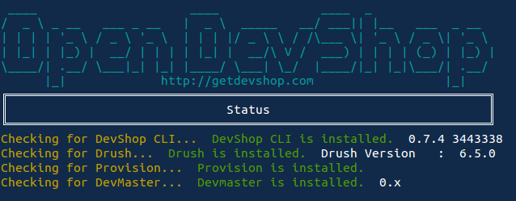

# Installing DevShop

There are a number of ways to get DevShop up and running: 1. **Install Script**: [https://github.com/opendevshop/devshop/blob/1.x/install.sh](https://github.com/opendevshop/devshop/blob/1.x/install.sh) Use the standalone install script to fully bootstrap a new Ubuntu or CentOS7 server. Instructions are below. Find the latest release on the [Releases page on the GitHub Repo](http://github.com/opendevshop/devshop/releases). 2. **Docker**: See [hub.docker.com/r/devshop/devmaster/](https://hub.docker.com/r/devshop/devmaster/) for instructions. 3. **Vagrant**: The [core project on GitHub](https://github.com/opendevshop/devshop) contains a Vagrantfile that you may use to launch a working devshop on your local computer. 4. **Ansible**: We have an Ansible role publicly available at [galaxy.ansible.com/opendevshop/devmaster](https://galaxy.ansible.com/opendevshop/devmaster/). The Vagrantfile and standalone install script both use Ansible roles to configure the servers.

## Standalone Install Script

DevShop can be installed with a standalone [install.sh bash](https://github.com/opendevshop/devshop/blob/1.x/install.sh) script, which kicks off an ansible playbook.

We test this script continuously on Ubuntu and CentOS 7. See [https://travis-ci.org/opendevshop/devshop](https://travis-ci.org/opendevshop/devshop) for the test results.

**NOTES:**

* Do not try to install devshop on a server that is already in use. If you do you will likely have to take manual steps to get it fully functional. It's just easier to start with a fresh server.
* If installing ubuntu manually, do _not_ choose "LAMP Server" or any other type. The install script & ansible role will install all necessary packages.
* **Always** run the install.sh script as _root_.  Using `sudo bash install.sh` may not work, as it uses /root/.my.cnf to track database permissions.

[1.x](https://github.com/opendevshop/devshop) is now the current stable branch. `0.x` branch is now deprecated! Drupal 6 is End of Life.

DevShop 1.x is based on Drupal 7 and runs Drupal 8 sites.

Our git tags are our releases. See [https://github.com/opendevshop/devshop/releases](https://github.com/opendevshop/devshop/releases) for the list of releases. There is an `install.sh` file in the "Downloads" section of every release.

_Please,_ check the releases page before installing for the first time to be sure you have the latest install script. In case there is a lag in updating the documentation, visiting the "releases" page will tell you the actual latest release.

## Setup

* Pick a domain and server name to use for DevShop, and pick a subdomain that makes sense, for example "devshop.mydomain.com"
* Fire up a linux server somewhere, using that domain name as the server's hostname. _You can change the hostname using the install script. See below._
  * Rackspace and DigitalOcean use the name of the server to automatically set the hostname.
* DNS Setup:
  * Add a DNS record that points your domain name \(devshop.mydomain.com\) to your server's IP address.
  * Add a second DNS record that points a wildcard subdomain of your domain \(\*.devshop.thinkdrop.net\) to your server's IP address. This allows you to setup new sites without having to mess with DNS every time.
  * Example DNS Records:

    ```text
      devshop.mydomain.com. 1800 IN A 1.2.3.4
      *.devshop.mydomain.com. 1800 IN A 1.2.3.4
    ```
* Login to your server, and retrieve and run the install script. Remember, check the [Releases Page](https://github.com/opendevshop/devshop/releases) on GitHub to be sure you have the latest release. If you wish to run HEAD \(which is normally stable\) you can pull the [1.x branch](https://raw.githubusercontent.com/opendevshop/devshop/1.x/install.sh) branch version of the install.sh script.

  ```text
    root@devshop:~# wget https://raw.githubusercontent.com/opendevshop/devshop/1.x/install.sh
    root@devshop:~# bash install.sh
  ```

* If you don't have root but have a sudo user:

  ```text
    ubuntu@devshop:~$ sudo su
    root@devshop:~# wget https://raw.githubusercontent.com/opendevshop/devshop/1.x/install.sh
    root@devshop:~# bash install.sh
  ```

* If you need to change the hostname, use the `--hostname` option:

  ```text
    root@devshop:~# bash install.sh --hostname=devshop.mysite.com
  ```

* If you wish to install NGINX instead of apache, use the `--server-webserver=nginx` option:

  ```text
     root@devshop:~# bash install.sh --server-webserver=nginx
  ```

* If you wish to use a different playbook or makefile for the devmaster front-end, you can use the `--makefile` and `--playbook` commands:

  ```text
     root@devshop:~# bash install.sh --makefile=devmaster-super.make --playbook=playbook-super.yml
  ```

* If you wish to set the Aegir user's UID to something other than 12345, you can use the `--aegir_user_uid` option. This might be useful if you are setting up Docker containers to mounting NFS.

Once you have devshop installed, switch to the Aegir user to access all of the files for all of your sites, include the devmaster front-end.

The most important commands to remember are `devshop status` and `devshop login`

```text
    root@devshop:~# su - aegir
    aegir@devshop:~$ devshop status
    aegir@devshop:~$ devshop login
```



## What does install.sh do?

We strive to make the source code as readable as possible, so please feel free to read through it.

In summary, the script does the following:

1. Installs git and Ansible.
2. Generates a secure MySQL password and saves it to the /root/.my.cnf.
3. Clones [http://github.com/opendevshop/devshop.git](http://github.com/opendevshop/devshop.git) to /usr/share/devshop and checks out the chosen version.  These files include the Ansible playbooks and variables files.
4. Runs the Ansible playbooks listed in [playbook.yml](https://github.com/opendevshop/devshop/blob/1.x/playbook.yml):
   * opendevshop.aegir-user
   * opendevshop.aegir-apache
   * geerlingguy.php
   * geerlingguy.php-mysql
   * geerlingguy.composer
   * opendevshop.devmaster
5. Runs the `devshop status` command to ensure everything is working properly.

